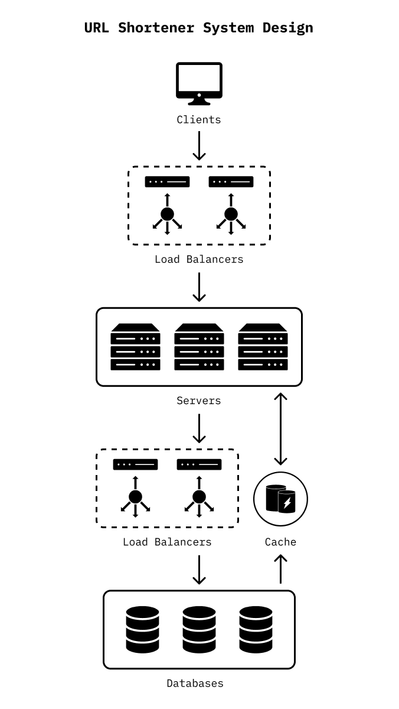

# 短網址系統設計

看完一些文章和影片講解後，還是似懂非懂，可能要實際操作才會更理解吧。（發現這個題目是某些企業的面試題目之一）

## References

1. [URL shortener system design | tinyurl system design | bitly system design](https://www.youtube.com/watch?v=JQDHz72OA3c&ab_channel=TechDummies)
2. [Designing a URL Shortening service like TinyURL - Grokking the System Design Interview](https://www.educative.io/courses/grokking-the-system-design-interview/m2ygV4E81AR)
3. [系統設計 - 設計縮網址服務 · jyt0532's Blog](https://www.jyt0532.com/2019/12/05/design-tiny-url/)
4. [短网址系统(TinyURL) · 系统设计(System Design)](https://soulmachine.gitbooks.io/system-design/content/cn/tinyurl.html)
