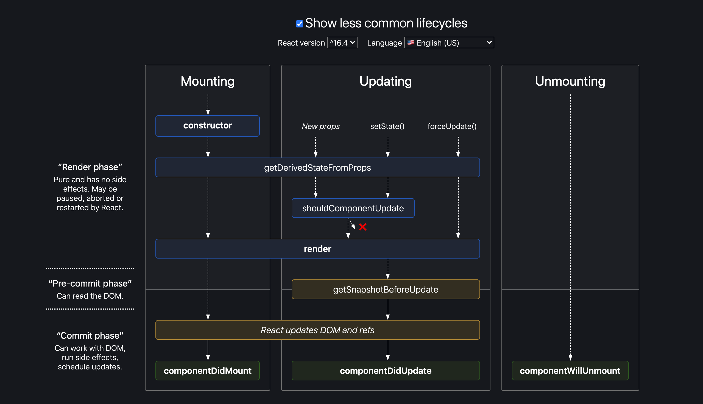

# 請列出 class component 的所有 lifecycle 的 method，並大概解釋觸發的時機點

每一個 component 都有數個 「生命週期方法」（lifecycle methods），你可以 override 這些方法，以便在開發過程中的特定時刻執行程式碼。（下列 [常用的生命週期方法](#commonly-used-lifecycle-methods) 將會以 **粗體** 表示）

另外，你可以使用 [這個生命週期表](https://projects.wojtekmaj.pl/react-lifecycle-methods-diagram/) 作為速查表（cheat sheet）。


(source: [React lifecycle methods diagram](https://projects.wojtekmaj.pl/react-lifecycle-methods-diagram/))

## Mounting

當一個 component 的 instance 被建立且加入 DOM 中時，其生命週期將會依照下列的順序呼叫這些方法：

- [**`constructor()`**](#constructor)
- [`static getDerivedStateFromProps()`](#static-getDerivedStateFromProps)
- [**`render()`**](#render)
- [**`componentDidMount()`**](#componentDidMount)

## Updating

當 prop 或 state 有變化時，就會產生更新。當一個 component 被重新 render 時，其生命週期將會依照下列的順序呼叫這些方法：

- [`static getDerivedStateFromProps()`](#static-getDerivedStateFromProps)
- [`shouldComponentUpdate()`](#shouldComponentUpdate)
- [**`render()`**](#render)
- [`getSnapshotBeforeUpdate()`](#getSnapshotBeforeUpdate)
- [**`componentDidUpdate()`**](#componentDidUpdate)

## Unmounting

當一個 component 被從 DOM 中移除時，這個方法將會被呼叫：

- [**`componentWillUnmount()`**](#componentWillUnmount)

## Error Handling

當一個 component 在 render 的過程、在一個生命週期、或在某個 child component 的 constructor 中發生錯誤時，呼叫這些方法。

- `static getDerivedStateFromError()`
- `componentDidCatch()`

## Commonly Used Lifecycle Methods

首先介紹絕大多數在建立 React component 時會使用到的幾種方法。

### `render()`

`render()` 是 class component 中唯一必要的方法。當 render 被呼叫時，它將會檢視 `this.props` 和 `this.state` 中的變化，並回傳以下類別之一：

- React elements
- Arrays and fragments
- Portals
- String and numbers
- Booleans or `null`

`render()` function 應該是單純的（pure），這表示它不會修改 component 的 state，在每次呼叫時都會回傳同樣的結果，它並不會直接和瀏覽器有所互動。

### `constructor()`

```javascript
constructor(props) {
  super(props);
  // Don't call this.setState() here!
  this.state = { counter: 0 };
  this.handleClick = this.handleClick.bind(this);
}
```

一個 React component 的 constructor 會在其被 mount 之前被呼叫。如果你沒有初始化 state 也不綁定方法的話，你的 React component 就不需要 constructor。

通常在 React 中 constructor 只會有兩種用途：

- 透過指定一個 `this.state` 物件來初始化內部 state。
- 為 event handler 方法綁定 instance。

### `componentDidMount()`

在一個 component 被 mount（加入 DOM tree）之後，`componentDidMount()` 會馬上被呼叫。需要 DOM node 的初始化應該寫在這個方法裡面。

你可以馬上在 `componentDidMount()` 內呼叫 `setState()`，這會觸發一次額外的 render，但會在瀏覽器更新螢幕之前發生。在這個情況下，即使 `render()` 被呼叫兩次，這確保使用者不會看見這兩次 render 中過渡時期的 state。請謹慎使用這個模式，因為這經常會導致效能問題。

### `componentDidUpdate()`

```javascript
componentDidUpdate(prevProps, prevState, snapshot)
```

`componentDidUpdate()` 會在更新後馬上被呼叫，這個方法並不會在初次 render 時被呼叫。

在 component 更新之後，可以在此處對 DOM 進行操作。此處也適合做網路請求，只要你有比較目前的 prop 和之前的 prop（如果 prop 沒有改變的話，網路請求可能並非必要）。

```javascript
componentDidUpdate(prevProps) {
  // Typical usage (don't forget to compare props):
  if (this.props.userID !== prevProps.userID) {
    this.fetchData(this.props.userID);
  }
}
```

你可以馬上在 `componentDidUpdate()` 內呼叫 `setState()`，但是要注意它必須被包在一個條件語句內，否則你會進入一個無限迴圈，這也會導致額外的 re-render，雖然使用者看不見，但這可能會影響 component 的效能。

### `componentWillUnmount()`

`componentWillUnmount()` 會在ㄧ個 component 被 unmount 和 destroy 後馬上被呼叫。你可以在這個方法內進行任何清理，像是取消計時器和網路請求或是移除任何在 `componentDidMount()` 內建立的 subscription。

你不應該在 `componentWillUnmount()` 內呼叫 `setState()`，因為這個 component 永遠不會再重新 render。當一個 component instance 被 unmount 後，它就永遠不會再被 mount。

## Rarely Used Lifecycle Methods

以下介紹的方法是在那些不常見的情況中使用的。它們有時很方便，但是大多數的 component 可能不需要使用。你可以在 [這個生命週期表](https://projects.wojtekmaj.pl/react-lifecycle-methods-diagram/) 上方點選「顯示不常用的生命週期」，並看到以下所介紹的方法。

### `shouldComponentUpdate()`

```javascript
shouldComponentUpdate(nextProps, nextState)
```

使用 `shouldComponentUpdate()` 來讓 React 知道一個 component 的 output 並不會被目前在 state 或 prop 內的改變所影響。React 的預設行為是每當 state 有所改變時就重新 render，在絕大多數的情況下，你應該依靠這個預設行為。

當新的 prop 或 state 被接收時，`shouldComponentUpdate()` 會在 render 之前被呼叫，其預設值是 `true`。它不會在初次 render 時或使用 `forceUpdate()` 時被呼叫。

目前，如果 `shouldComponentUpdate()` 回傳 `false` 的話，`UNSAFE_componentWillUpdate()`、`render()` 和 `componentDidUpdate()` 都不會被呼叫。在未來，React 可能會把 `shouldComponentUpdate()` 當作一個提示而非一個嚴格指令，而回傳 `false` 可能還是會讓 component 重新 render。

### `static getDerivedStateFromProps()`

```javascript
static getDerivedStateFromProps(props, state)
```

`getDerivedStateFromProps` 會在一個 component 被 render 前被呼叫，不管是在首次 mount 時或後續的更新時。它應該回傳一個 object 以更新 state，或回傳 `null` 以表示不需要更新任何 state。

這個方法在每一次 render 時都會被觸發，這和 `UNSAFE_componentWillReceiveProps` 有所不同，`UNSAFE_componentWillReceiveProps` 只有當 parent 導致重新 render 時被觸發，而非當本地的 `setState` 導致重新 render 時被觸發。

### `getSnapshotBeforeUpdate()`

```javascript
getSnapshotBeforeUpdate(prevProps, prevState)
```

`getSnapshotBeforeUpdate()` 會在最近一次的 render output 被提交給 DOM 時被呼叫。它讓你在 DOM 改變之前先從其中抓取一些資訊（例如 scroll position）。這個生命週期方法回傳的值會被當作一個參數傳遞給 `componentDidUpdate()`。

這個方法並不常見，但它可能會出現在對話串這類需要以某種特殊方式處理滾動軸位置的 UI 中。

一個 snapshot 的值（或 `null`）應該被回傳。

## Legacy Lifecycle Methods

以下介紹的幾個生命週期方法是「過時」的。它們仍然能運作，但我們並不建議你在新的程式碼內使用這些方法。你可以 [在這篇文章中](https://reactjs.org/blog/2018/03/27/update-on-async-rendering.html) 了解如何將過時的方法轉移到我們建議的方法。

- `componentWillMount()`
- `componentWillReceiveProps()`
- `componentWillUpdate()`

## References

- [React lifecycle methods diagram](https://projects.wojtekmaj.pl/react-lifecycle-methods-diagram/)
- [React.Component - React](https://reactjs.org/docs/react-component.html)
- [State and Lifecycle - React](https://reactjs.org/docs/state-and-lifecycle.html)
- [Update on Async Rendering - React Blog](https://reactjs.org/blog/2018/03/27/update-on-async-rendering.html)
