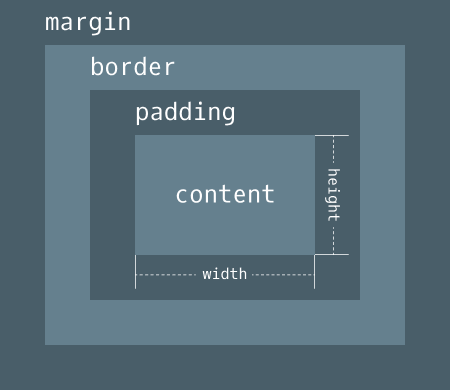

## 請找出三個課程裡面沒提到的 HTML 標籤並一一說明作用。

1. `<aside>`：可以被獨立於主要內容之外的區塊，通常表現為側邊欄（sidebar）或標註框（call-out box）。常見於部落格和電商網站。

2. `<figure>`：代表獨立的內容，可能附帶說明文字，經常與 `<figcaption>` 一起使用。

   ``` html
   <figure>
     
     <figcaption>This is a logo</figcaption>
   </figure>
   ```

3. `<picture>`：包含零或零以上個 `<source>` 元素以及一個 `` 元素，為不同顯示裝置提供同張圖片的不同版本。瀏覽器會從每個 `<source>` 元素中選出最適當的選項，如果沒有符合的選項，或是瀏覽器不支援 `<picture>` 元素，則 `` 屬性中 `src` 的 URL 會被選擇。

   ``` html
   <picture>
     <source srcset="logo@3x.png" media="(min-width: 1920px)">
     <source srcset="logo@2x.png" media="(min-width: 768px)">
     
   </picture>
   ```

## 請問什麼是盒模型（box model）

網頁頁面中的每一個元素都符合 box model，是由幾個不同的矩形框所組成，並對應到不同的 CSS 屬性：

* Content box: `width` and `height`
* Padding box: `padding`
* Border box: `border`
* Margin box: `margin`



在 CSS 中，可以透過 `box-sizing` 設定元素大小的計算方式：

1. `content-box`：瀏覽器預設的行為，元素大小由 `width` 和 `height` 決定
2. `border-box`：元素大小為 `width`、`height`、`padding`、`border` 組成

## 請問 display: inline, block 跟 inline-block 的差別是什麼？

1. ``` css
   display: inline;
   ```

   Inline elements 不會造成換行，可與其他元素水平並排，例如：`<a>`、`<button>`、`<input>`、`<span>`

2. ``` css
   display: block;
   ```

   Block-level elements 會佔據整行上層容器的空間（width），例如：`<div>`、`<footer>`、`<header>`、`<section>`

3. ``` css
   display: inline-block;
   ```

   混合 inline 與 block 的特性，可與其他元素水平並排，也可以設定元素的 `width`、`height`、`padding`

## 請問 position: static, relative, absolute 跟 fixed 的差別是什麼？

1. ``` css
   position: static;
   ```

   瀏覽器預設的行為，元素按照網頁正常的排版流來定位

2. ``` css
   position: relative;
   ```

   可以透過 `top`、`right`、`bottom`、`left` 改變定位，且不會影響其他元素的位置，但該元素原本在頁面中的空間會被保留；沒有設定偏移時，表現和 `static` 一樣

3. ``` css
   position: absolute;
   ```

   依據上層容器的相對位置定位，如果上層沒有可以被定位的元素，則會定位在頁面的最左上角，可以透過 `top`、`right`、`bottom`、`left` 改變定位，元素原本在頁面中的空間會被移除

4. ``` css
   position: fixed;
   ```

   根據瀏覽器視窗來定位，當頁面上下滾動時，會固定在相同的位置，可以透過 `top`、`right`、`bottom`、`left` 改變定位，元素原本在頁面中的空間會被移除
